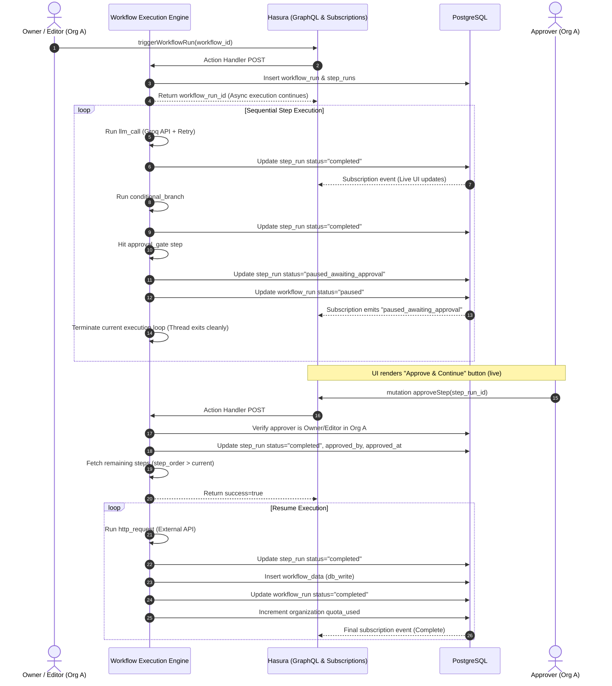

# AI Agent Workflow Builder — Architecture & Security Write-Up

## 1. Schema Reasoning & Design

The database schema is purpose-built to model multi-tenant, DAG-like AI agent pipelines with mid-execution approval gating and live step tracking.

```
organizations ────< org_members >──── users
     │
     └───< workflows ────< workflow_steps (ordered execution units)
             │       └───< workflow_triggers (manual, webhook, cron, event)
             │
             └───< workflow_runs ────< step_runs (input, output, status, approvals)
                     │
                     └───< workflow_data (db_write sandbox storage)
```

### Key Design Decisions:
1. **Separation of Workflow Definitions and Execution Instances**: `workflows` and `workflow_steps` define configuration blueprints, while `workflow_runs` and `step_runs` capture runtime state, inputs, outputs, errors, attempt counters, and audit trails (`approved_by`, `approved_at`).
2. **Step Order and State Machine**: Each `step_runs` row tracks granular states: `pending` → `running` → `completed` | `failed` | `skipped` | `paused_awaiting_approval`. This matches subscription listeners without state ambiguity.
3. **Usage & Quota Aggregation**: A dedicated Postgres view `org_usage_stats` calculates real-time metrics (monthly runs, average run duration in seconds, successful vs. failed runs) directly at the database engine level, minimizing application overhead.

---

## 2. Two-Layer Permission Architecture

Data isolation and privilege escalation are prevented through two distinct, defense-in-depth enforcement layers.

```
┌────────────────────────────────────────────────────────────────────────┐
│ Layer 1: Database & Hasura RLS (Org-Scoped Session Boundaries)        │
│ • Enforced on: GraphQL Queries, Mutations, Subscriptions               │
│ • Mechanism: Relationship traversal via org_members using X-Hasura-User│
│ • Result: Direct ID guessing across orgs returns 0 rows (Airtight)     │
└────────────────────────────────────────────────────────────────────────┘
                                    │
                                    ▼
┌────────────────────────────────────────────────────────────────────────┐
│ Layer 2: Action Handler Code Gating (Privilege & Mid-Flight Decisions) │
│ • Enforced on: triggerWorkflowRun, approveStep, webhookTrigger         │
│ • Mechanism: Serverless handler queries org_members role before action │
│ • Result: Editor cannot add db_write; Viewer cannot trigger;           │
│   Non-owner/editor in Org cannot approve paused runs.                   │
└────────────────────────────────────────────────────────────────────────┘
```

### Layer 1: Org + Role Scoping (Hasura Row-Level Security)
Hasura permissions enforce that a user can **only** read or mutate records where their authenticated `x-hasura-user-id` is linked to the record's parent organization via `org_members`.

For example, selecting from `workflows` uses the boolean expression:
```json
{
  "organization": {
    "org_members": {
      "user_id": { "_eq": "X-Hasura-User-Id" }
    }
  }
}
```
*Impact*: Even if an attacker in **Org B** obtains a valid UUID for a workflow or run in **Org A**, Hasura evaluates the join condition against `org_members` and returns `null` or empty arrays.

### Layer 2: Step-Level Gating & Mid-Execution Enforcement
Database row permissions alone cannot evaluate mid-execution branching or dynamic runtime privileges. Layer 2 is enforced inside the serverless Action handlers:
1. **Restricted Step Types**: Step types that escape the sandbox (such as `db_write` or `notify`) and inbound `webhook` triggers require an `owner` role.
2. **Execution Gating**: When `triggerWorkflowRun` executes, the handler queries `org_members` for `(user_id, org_id)` and rejects `viewer` accounts with HTTP 403.
3. **Approval Gating**: When `approveStep` is invoked, the handler verifies that the approving user is explicitly an `owner` or `editor` in that specific workflow's organization before releasing the execution lock.

---

## 3. Approval Gate: Pause & Resume Implementation

The approval gate pattern allows long-running asynchronous workflows to pause safely without holding open HTTP connections or serverless execution threads.



### Key Engineering Details:
- **Stateless Pause**: The engine does not keep memory locks or active timers. Execution terminates cleanly upon setting `paused_awaiting_approval`.
- **Live Reactivity**: Frontend subscribers on `step_runs(where: { workflow_run_id: $id })` receive real-time WebSocket frames. The UI seamlessly renders the glowing approval state and action buttons without a page refresh.
- **Resumption with Context**: When `approveStep` is authorized, the engine queries `GET_REMAINING_STEP_RUNS` with `step_order > currentStepOrder` and continues the pipeline, passing previous step outputs down the DAG until completion.
